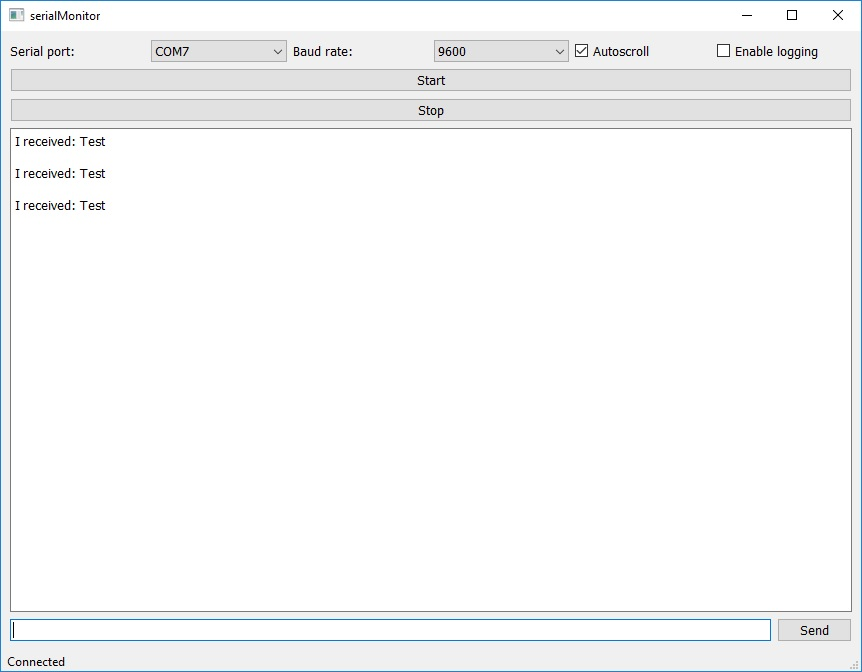

# serialMonitor

Simple application which allow to monitor serial port. Tested and working under Windows and Linux.

## Functions:

* Automatically detects active COM ports (only active COM ports will be shown in drop-down list) 
* Allow to log into a file (default folder for log files is: serialMonitorLogs)
* Autoscroll focus cursor on current received line

## Used libraries versions:

* Python 3.7
* PyQt5 5.10.1
* pyserial 3.4

## Tested on following Operating Systems:

* Windows 10
* Ubuntu 18.04 LTS (In my case, I need to give permisions to access serial port by command: `sudo chmod 666 /dev/ttyS2`, where 2 could be replace by any port number)

## Screenshots:

